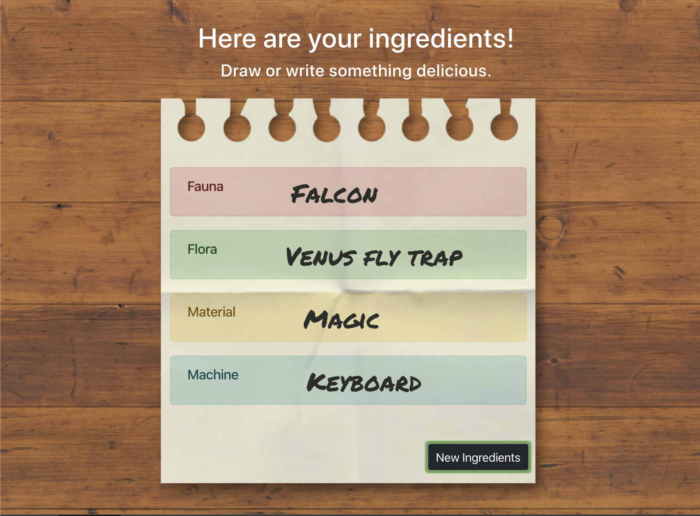

# Art Kitchen
Ever been stopped by art block or an empty canvas? Our web app, Art Kitchen, generates random words for you to use as inspiration and allows you to post it for all to see! You can see all posts submitted by other users or keep track of your own on the profile page. 

## Technologies Used
* HTML
* CSS
* Bootstrap
* Javascript
* Node.js
* Express
* Express-session
* Bcryptjs
* Connect-mongo
* Mongoose
* MongoDB

## Existing Features
* Users can sign up, sign in, and log out
* Users can use the word generator and receive 4 words to inspire art
* Users can post their images or poems with the tags (generator words) automatically included
* All user posts can be viewed on the Feed page
* Users can view their posts and user information on their profile page
* Users can edit their profile (profile picture and bio)
* Users can also edit their posts (title and description) and delete them.
* Displays styled 'Error 404' page when a user tries to reach a nonexistent page.

## Planned Features
* Ability to upload images
* Feed page sorting and search bar
* Allow users to search by tags when clicking on tag
* Allow users to toggle generator tags on and off by which words they've used in their art
* Feed page showing limited number of posts at a time
* Add comments to posts
* Add like/voting options to posts
* Ability to search for other users and view their profiles
* Add maximum limit on displayed characters in text posts and add 'more' button to view entire post
* Allow users to click on posts to see the post individually as well as the post's comments

### Wireframes

#### Home Page
 

#### Generator Page
 

#### Profile Page
 

#### FEED Page
 

### Screenshots

#### Home Page

#### Generator
 

#### Profile Page

